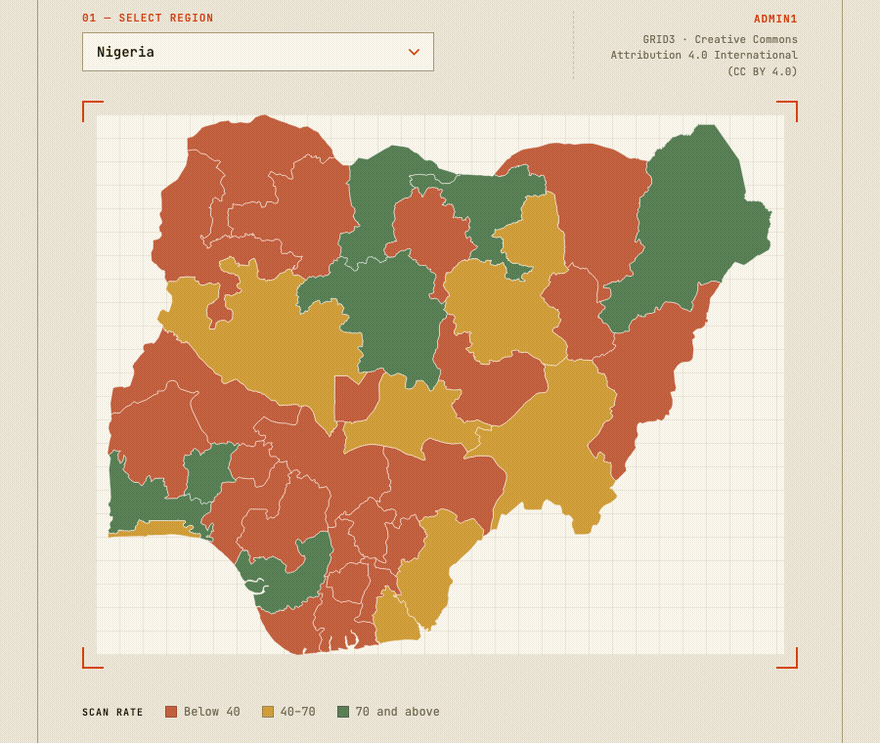

# @geo-atlas/core

[](https://www.npmjs.com/package/@geo-atlas/core)
[](https://www.npmjs.com/package/@geo-atlas/core)
[](../../LICENSE)

Normalized, validated GeoJSON boundary data (countries and their admin1 subdivisions), sourced from [geoBoundaries.org](https://www.geoboundaries.org/). Fetches, validates the response shape, and rewinds ring winding order to the convention d3-geo (and anything built on it, like react-simple-maps) expects — so you don't have to debug why your map renders inside-out.



Try it live: [Boundary Explorer](https://layrayson.github.io/geo-atlas/) · [Documentation](https://layrayson.github.io/geo-atlas/docs/)

## Install

```bash
npm install @geo-atlas/core
```

## Usage

```ts
import { getBoundaries } from "@geo-atlas/core";

const boundaries = await getBoundaries({ country: "NG" }); // or "NGA"
// boundaries.features -> GeoJSON features for Nigeria's states
// boundaries.meta -> { provider, license, sourceName, sourceUrl, ... }
```

`country` accepts either an ISO 3166-1 alpha-2 (`"NG"`) or alpha-3 (`"NGA"`) code. `level` defaults to `"admin1"` (state/province); `resolution` defaults to `"simplified"`.

## Browser usage and CORS

geoBoundaries' download URLs redirect through a Git-LFS hop that fails CORS when called directly from a browser with no backend. Two ways around it:

- **Server-side / SSR** (Node, an API route, build-time): works with no extra setup.
- **Client-side with no backend**: 197 of 249 recognized countries/territories are mirrored on a CDN ([geo-atlas-data](https://github.com/layrayson/geo-atlas-data), served via jsDelivr) and work with zero setup. Everything else needs a `fetchImpl` option that routes through your own same-origin proxy:

```ts
const boundaries = await getBoundaries(
  { country: "DE" },
  { fetchImpl: (url, init) => fetch(`/api/proxy?url=${encodeURIComponent(url)}`, init) }
);
```

Pass `{ preferLive: true }` to skip the CDN mirror and always fetch current data straight from geoBoundaries (accepting the same CORS constraint above).

## What's not covered

- The 52 territories not on the CDN mirror are mostly dependent territories, microstates, and a few disputed entities that geoBoundaries doesn't publish admin1-level data for (Bermuda, Hong Kong, Puerto Rico, Vatican City, Antarctica, etc.) — see [geo-atlas-data](https://github.com/layrayson/geo-atlas-data)'s `manifest.json` for the exact list.
- ADM2 (district-level) data is out of scope for now — geoBoundaries' ADM2 files run 10-20x larger than ADM1.
- GADM is intentionally excluded as a source — its license blocks redistribution, which the CDN mirror depends on.

## License

MIT. Mirrored boundary data itself is redistributed under each country's own upstream license (CC BY variants, Public Domain, or Etalab Open License 2.0) — see [geo-atlas-data](https://github.com/layrayson/geo-atlas-data)'s `manifest.json` for the specific license per country.
